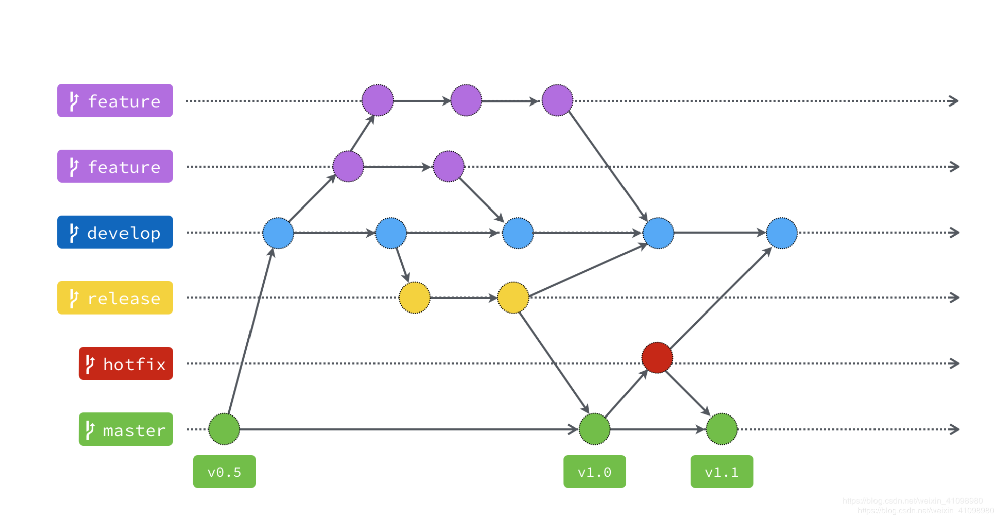

## 常用git命令

```bash
#初始化git
git init 
#提交所有代码到暂缓区
git add .
#将缓存区的代码提交到本地仓库，并添加说明
git commit -m '提交说明'
#将本地仓库和远程仓库关联
git remote add origin http://github.com/atomjaylee/git_test.git
#将本地仓库代码同步到远程仓库
git push -u origin master
#创建dev分支
git branch dev
#切换到dev分支
git checkout dev
#回退到指定的版本
git reset --soft/mixed/hard HEAD <commit-hash>
#回退到指定版本
git revert <commit-hash>
#将dev合并到当前分支
git merge dev
#删除dev分支
git branch -d dev
#将代码推进到指定版本
git rebase <commit-hash>
#查看现在存在的分支
git branch
#查看提交记录
git reflog
```

## git分支命令规范

### **分支命名**

**master 分支**

- master 为主分支，也是用于部署生产环境的分支，确保master分支稳定性
- master 分支一般由develop以及hotfix分支合并，任何时间都不能直接修改代码

**develop 分支**

- develop 为开发分支，始终保持最新完成以及bug修复后的代码
- 一般开发的新功能时，feature分支都是基于develop分支下创建的

**feature 分支**

- 开发新功能时，以develop为基础创建feature分支
- 分支命名: feature/ 开头的为特性分支， 命名规则: feature/userInfo、 feature/auth-rebuild

**release分支**

- release 为预上线分支，发布提测阶段，会release分支代码为基准提测

  > feature开发后，会将代码合并到dev分支，然后需要新建release分支，进入提测阶段，后续测试存在的问题和bug都在这个分支上修改，当时测试完成，我们需要将release代码同步到dev和master分支，发布上线

**hotfix 分支**

- 分支命名: hotfix/ 开头的为修复分支，命名规则和 feature 相同
- 线上出现紧急问题时，需要及时修复，以master分支为基线，创建hotfix分支，修复完成后，需要合并到master分支和develop分支



### **日志规范**

>feat: 添加新特性
>
>fix: 修复bug
>
>docs: 仅仅修改了文档
>
>style: 仅仅修改了空格、格式缩进、都好等等，不改变代码逻辑
>
>refactor: 代码重构，没有加新功能或者修复bug
>
>perf: 增加代码进行性能测试
>
>test: 增加测试用例
>
>chore: 改变构建流程、或者增加依赖库、工具等

例子： feat(components/utils): 新增权限配置方法

​			<回车 - 空一行>

​			因后端同步权限需要接收每个字段的id，该方法替代oneStepAuthData方法，配置页面权限信息 

​			<回车 - 空一行>		

​			issues地址或者禅道bug地址		